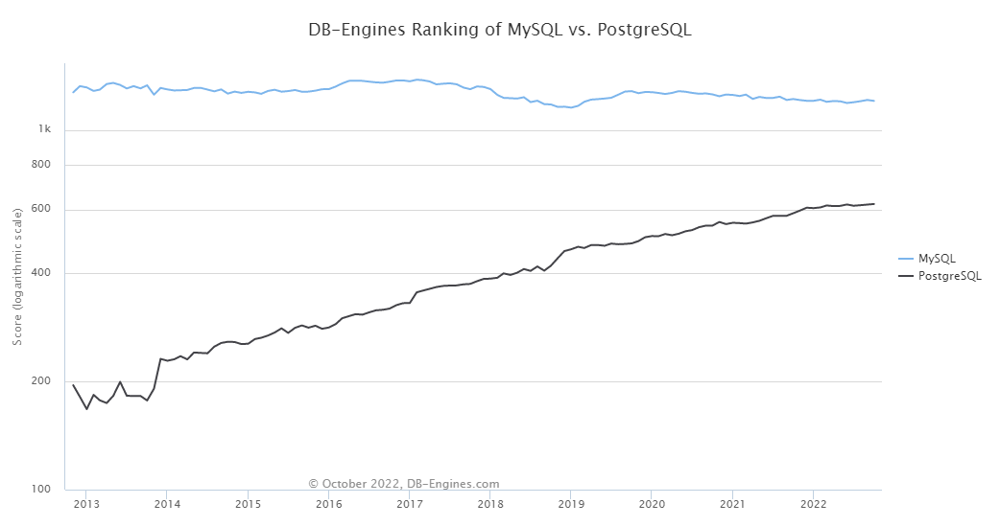

# Database

- We will use SQL to query for data
  - Flat file database for recordings
    - No repetitions anyway due to location, time stamps
  - Relational database to store user information
- We will use (most likely) MongoDB for both databases
  - We have used it and linked it before so will be relatively easy to do

## Relational database choice

We will use PostgreSQL for the relational database as it offers a lot of features like SQL querying, API support, migration to bigger databases and is supported on many operating systems

`https://db-engines.com/en/system/PostgreSQL`

We could have also chosen MySQL to create our relational database for the users but we decided on PostgreSQL as it is becoming more popular due to its API support.

### Setting up PostgreSQL

Set up in a virtual machine which will host the database.
